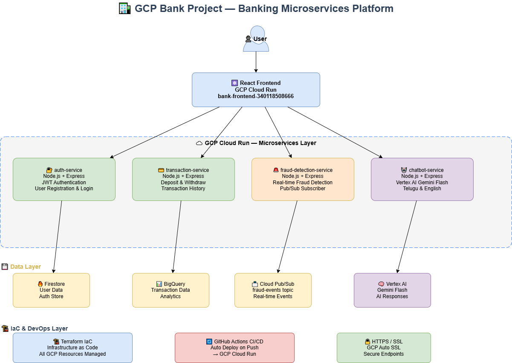

# 🏦 GCP Bank Project — Banking Microservices Platform


> Cloud-native Banking Microservices on Google Cloud Platform — Auth, Transactions, Fraud Detection & AI Chatbot

## 🚀 Live Demo

| Service | URL |
|---------|-----|
| Banking App | https://bank-frontend-340118508666.asia-south1.run.app |
| Auth Service | https://auth-service-25xh6d64va-el.a.run.app |
| Transaction Service | https://transaction-service-25xh6d64va-el.a.run.app |
| Fraud Detection | https://fraud-detection-service-25xh6d64va-el.a.run.app |
| Chatbot Service | https://chatbot-service-25xh6d64va-el.a.run.app |

## 🏗 Architecture

React Frontend
│
▼
┌─────────────────────────────────────┐
│         GCP Cloud Run               │
│  ┌──────────┐  ┌─────────────────┐  │
│  │auth-svc  │  │transaction-svc  │  │
│  │JWT+Fire  │  │BigQuery+Pub/Sub │  │
│  └──────────┘  └─────────────────┘  │
│  ┌──────────┐  ┌─────────────────┐  │
│  │fraud-svc │  │chatbot-svc      │  │
│  │Pub/Sub   │  │Vertex AI Gemini │  │
│  └──────────┘  └─────────────────┘  │
└─────────────────────────────────────┘

## 🔧 Services

| Service | Tech | Description |
|---------|------|-------------|
| auth-service | Node.js + Firestore + JWT | User registration, login & token validation |
| transaction-service | Node.js + BigQuery + Pub/Sub | Deposit, withdraw & transaction history |
| fraud-detection-service | Node.js + Pub/Sub + BigQuery | Real-time fraud detection via event streaming |
| chatbot-service | Node.js + Vertex AI Gemini | Telugu & English AI banking assistant |

## 💻 Tech Stack

| Layer | Technology |
|-------|-----------|
| Cloud Runtime | GCP Cloud Run |
| AI | Vertex AI (Gemini Flash) |
| Messaging | Cloud Pub/Sub |
| Database | BigQuery + Firestore |
| IaC | Terraform |
| Frontend | React + JWT Auth |
| Backend | Node.js + Express |
| Container | Docker |

## 📁 Project Structure
bank-project-backend/
├── auth-service/          # JWT Authentication
├── transaction-service/   # Deposits & Withdrawals
├── fraud-detection-service/ # Pub/Sub Fraud Engine
├── chatbot-service/       # Vertex AI Chatbot
└── main.tf               # Terraform IaC
## 🚀 Setup & Deploy

```bash
# Clone
git clone https://github.com/krishnancloud-KC/bank-project-backend.git

# Deploy to GCP Cloud Run
gcloud run deploy auth-service --source ./auth-service --region asia-south1
gcloud run deploy transaction-service --source ./transaction-service --region asia-south1
gcloud run deploy fraud-detection-service --source ./fraud-detection-service --region asia-south1
gcloud run deploy chatbot-service --source ./chatbot-service --region asia-south1
```

## 🔐 Test Credentials
Email: test@bank.com
Password: Test@123
---
*GCP Bank Project | krishnancloud-KC | April 2026 | Cost: FREE ₹0*
